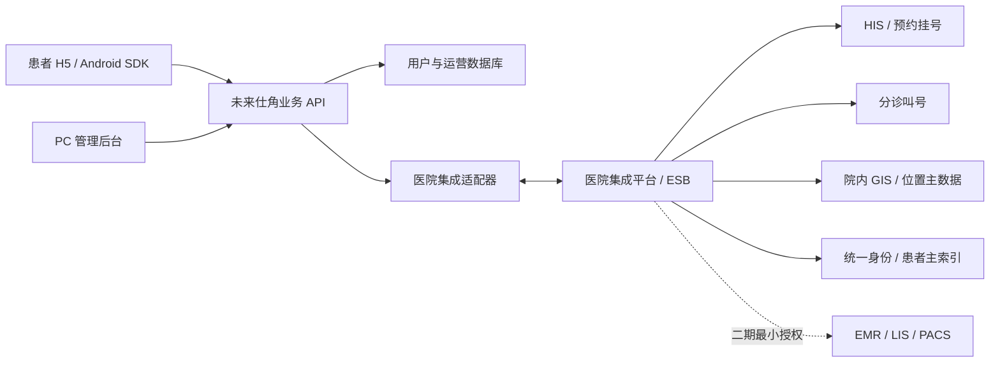

# 未来仕角医院系统对接说明（v1.1）

本文给医院信息科、HIS 厂商和项目实施人员使用。接口定义以 [`openapi.yaml`](./openapi.yaml) 为准，字段来源与标准映射见 [`FIELD_MAPPING.md`](./FIELD_MAPPING.md)。

## 1. 当前可交付边界

| 能力 | 当前状态 | 医院正式接入需要提供 |
| --- | --- | --- |
| 医院、科室、医生、楼层、宣教内容 | 已实现数据库、同步接口、前后台联动 | HIS/集成平台主数据接口或定时导出 |
| 导诊规则与科室推荐 | 已实现，危险信号先分流 | 医务科审核规则与科室编码映射 |
| 号源查询 | 已实现统一查询接口 | HIS/预约平台号源接口与增量同步 |
| 预约申请、取消申请 | 已实现本地订单与待确认状态 | 医院预约平台确认/取消适配器 |
| 候诊排队 | 已实现查询与回传数据模型 | 分诊叫号系统实时或准实时接口 |
| 用户、会话、个人导诊记录 | 已实现 | 正式环境可选医院统一身份认证/患者主索引 |
| LIS/PACS/EMR | 未直接读取，刻意隔离 | 二期仅通过医院授权网关提供最小必要数据 |

“已创建预约申请”不等于医院挂号成功。只有医院回传 `appointment_status=confirmed` 后才向患者显示“预约成功”。当前公网环境为演示系统，不接收真实患者身份、病历、检查报告或支付信息。

## 2. 推荐系统边界



首选由医院集成平台统一暴露接口；不建议 APP 直接连接 HIS、EMR、LIS、PACS 数据库。正式部署建议放在医院 DMZ/专有云，通过专线、VPN 或双向 TLS 访问院内集成平台。

## 3. 对接接口清单

### 患者端/管理端

- `GET /api/v1/catalog`：医院、科室、医生、位置、宣教内容。
- `POST /api/v1/triage/recommendations`：危险信号判断与科室推荐。
- `GET /api/v1/schedules`：按日期和科室查询号源。
- `POST /api/v1/appointments`：创建预约申请，返回 `202 pending`。
- `GET /api/v1/appointments`：当前登录用户的预约记录。
- `GET /api/v1/appointments/{id}`：预约状态。
- `DELETE /api/v1/appointments/{id}`：申请取消，返回 `202 cancel_requested`。
- `GET /api/v1/appointments/{id}/queue`：候诊队列。
- `GET /api/v1/admin/overview`：管理后台真实汇总；`demo=1` 仅返回脱敏演示数据。
- `PATCH /api/v1/admin/content/{entity}/{id}`：管理员维护科室、医生、宣教内容。

### 医院集成端

- `POST /api/v1/integration/sync`：医院向未来仕角增量同步主数据、号源、预约结果和队列。
- `GET /api/v1/integration/appointments?status=pending`：医院适配器拉取待处理预约。
- `GET /api/v1/integration/appointments?status=cancel_requested`：拉取待取消订单。

同步 `resourceType`：

| resourceType | 来源系统 | 关键字段 |
| --- | --- | --- |
| `hospital` | HIS/集成平台 | `id, code, name, shortName, address` |
| `department` | HIS | `id, hospitalId, code, name, floor, description` |
| `doctor` | HIS/人事 | `id, hospitalId, departmentId, code, name, title, specialty` |
| `location` | GIS/后勤 | `id, hospitalId, code, name, building, floor` |
| `knowledge` | CMS/宣教平台 | `id, hospitalId, category, title, summary` |
| `schedule` | 预约平台 | `id, hospitalId, departmentId, externalScheduleId, serviceDate, startTime, endTime` |
| `appointment_status` | 预约平台 | `appointmentId, status, externalAppointmentId` |
| `queue` | 分诊叫号 | `appointmentId, queueNumber, peopleAhead, estimatedMinutes, status` |

## 4. 鉴权与防重放

医院接口必须使用 HTTPS，并携带：

- `X-FSJ-Client-Id`
- `X-FSJ-Timestamp`：Unix 秒，服务端允许前后 5 分钟。
- `X-FSJ-Nonce`：每次请求唯一，10 分钟内不可重复。
- `X-FSJ-Signature`：小写十六进制 HMAC-SHA256。

签名原文：

```text
HTTP_METHOD\n
PATH_WITH_QUERY\n
TIMESTAMP\n
NONCE\n
SHA256_HEX(RAW_BODY)
```

Node.js 签名示例：

```js
import crypto from "node:crypto";

const method = "POST";
const path = "/api/v1/integration/sync";
const timestamp = Math.floor(Date.now() / 1000).toString();
const nonce = crypto.randomUUID();
const body = JSON.stringify({
  requestId: crypto.randomUUID(),
  resourceType: "department",
  items: [{ id: "dept-001", hospitalId: "hospital-001", code: "CARD", name: "心血管内科", floor: "门诊楼 3F", description: "心血管疾病门诊" }],
});
const bodyHash = crypto.createHash("sha256").update(body).digest("hex");
const canonical = [method, path, timestamp, nonce, bodyHash].join("\n");
const signature = crypto.createHmac("sha256", process.env.FSJ_SECRET).update(canonical).digest("hex");
```

生产环境再叠加：医院出口 IP 白名单、双向 TLS 或 VPN、密钥按院区独立、90 天轮换、失败告警。密钥不得写入 APP、网页、URL、Git 或日志。

## 5. 幂等与状态机

- 每批同步 `requestId` 全局唯一；重复提交返回原结果和 `idempotentReplay=true`。
- 预约 `requestId` 或 `Idempotency-Key` 全局唯一；客户端超时后应使用同一值重试。
- 单批同步 1–500 条；部分失败返回 HTTP `207` 和失败索引。
- 预约状态：`pending -> confirmed | failed`；取消时 `confirmed|pending -> cancel_requested -> cancelled|failed`。
- 排队状态：`waiting -> calling -> completed`，失效为 `expired`。
- 不允许客户端自行把 `pending` 改为 `confirmed`，确认状态只能由医院签名接口回传。

## 6. 医院实施所需材料

医院/厂商需提供：

1. 测试环境 Base URL、VPN/白名单要求、接口联系人和故障联系人。
2. 医院、院区、科室、医生、职称、楼栋楼层的编码表与停用规则。
3. 号源查询、锁号/挂号、取消、退号、叫号接口文档及错误码。
4. 患者身份映射方式：优先一次性授权码或不可逆患者令牌，禁止直接传身份证明文。
5. 峰值 QPS、超时、重试、维护窗口、数据延迟目标。
6. 医务科确认的导诊规则、急危重信号、免责声明和转人工流程。
7. 等保、日志留存、数据出境、灾备和渗透测试要求。

## 7. 联调验收清单

- 主数据全量一次、增量三次，新增/修改/停用均能同步。
- 号源剩余量、停诊、跨日与时区准确；不得超卖。
- 预约超时重试不产生重复挂号；医院确认前不显示成功。
- 取消、医院退号、停诊改期、叫号完成的状态闭环一致。
- 未登录不可读取个人预约；普通用户不可调用管理接口。
- 错误签名、过期时间戳、重复 nonce、重复 requestId 都有确定响应。
- APP 在缺失 WebView、WebView 渲染进程退出、断网和 SSL 错误时显示恢复页，不直接退出。
- 审计日志不记录身份证、手机号、病历正文、密钥和完整令牌。

## 8. 正式上线前仍需完成

当前代码已具备可演示联动和医院适配器接口，但尚未拿到具体医院的 HIS/预约/叫号地址、字段和凭据，因此没有伪造“已连接医院”。拿到院方材料后，需要为该医院实现一个适配器，把院方协议转换为本文统一模型，并完成医院测试环境、预生产、生产三阶段验收。
